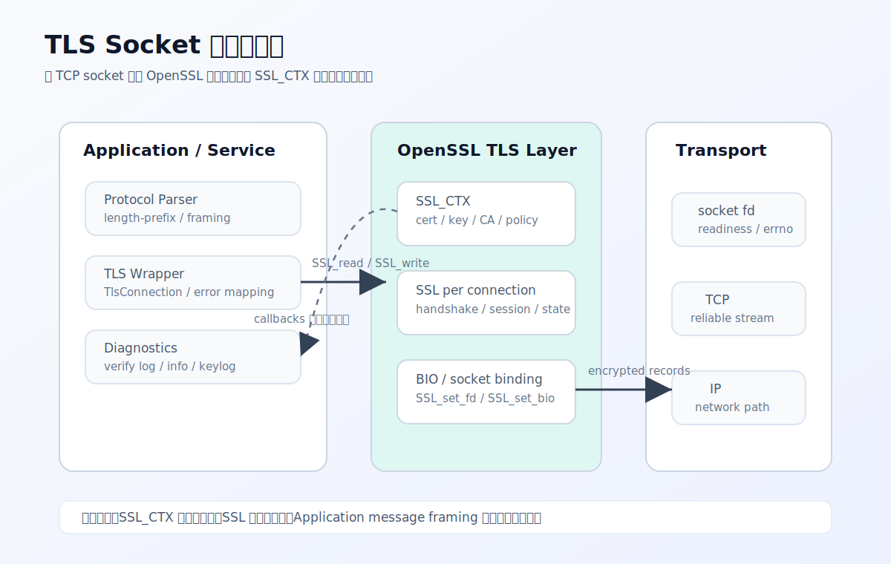
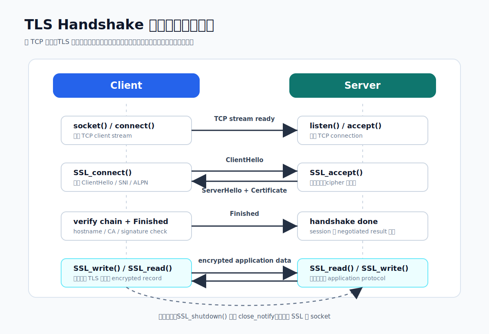
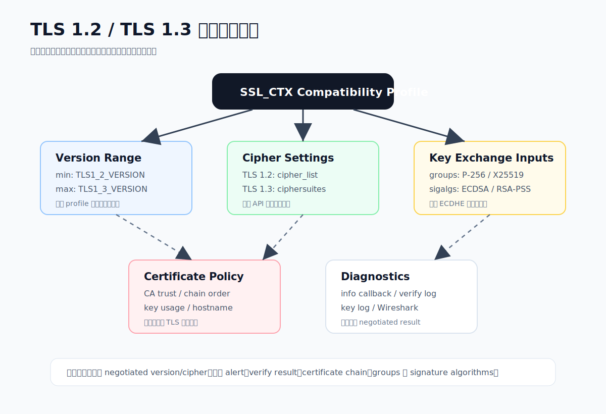

# TLS 程式設計的講義
> 從 TCP socket 轉換到 TLS socket，掌握 OpenSSL 的 `SSL_CTX`、`SSL`、BIO、憑證驗證、callback 設計，以及 TLS 1.2/TLS 1.3 相容性的程式設定。

[summary]
- 🧭 **目標對象** | 熟悉 TCP socket，準備把既有 Client/Server 升級為 TLS 的韌體、網通與測試工程師
- 🔐 **核心能力** | 建立 TLS context、載入憑證、執行 handshake，並用 `SSL_read` / `SSL_write` 收發資料
- 🧩 **API 與 Callback** | 理解 verify、SNI、ALPN、info、keylog 與 session callback 的使用時機
- 🧪 **相容測試** | 用明確的版本、cipher suite、group、signature algorithm 設定處理 TLS 1.2/TLS 1.3 共存
[/summary]

## TLS Socket 架構總覽

### TLS Socket 程式架構圖



### 架構圖閱讀重點
- Application 不直接碰 TCP 明文資料，而是透過 `SSL_read()` 與 `SSL_write()` 進入 TLS 狀態機
- `SSL_CTX` 放共用安全政策，包含版本、cipher、CA、憑證、私鑰與 callback
- 每一條連線建立自己的 `SSL` 物件，綁定一個 socket fd 或 BIO
- Callback 與 diagnostics 應從一開始納入設計，否則 handshake failure 會很難定位

### TLS Handshake 與資料收發流程圖



### 流程圖閱讀重點
- TCP connect 或 accept 只是底層連線完成，還不代表 TLS 可收發資料
- TLS handshake 成功後，application data 才會進入加密保護
- 關閉時應優先走 `SSL_shutdown()`，讓對端收到 `close_notify`
- 非阻塞模式下，每一步都可能回到 event loop 等待 read/write readiness

## 從 TCP Socket 到 TLS Socket

### TCP Socket 的責任邊界
- TCP 負責連線、可靠傳輸、重送與順序控制
- TCP 不負責資料加密、完整性驗證或對端身分驗證
- 若直接用 `send()` / `recv()` 傳輸敏感資料，封包內容可被側錄與竄改
- TLS 的角色是在 application data 進入 TCP 前，先完成加密、驗證與 record 封裝

```prompt [label="典型 TCP Client 流程"]
socket()
connect()
send()
recv()
close()
```

```prompt [label="典型 TLS Client 流程"]
socket()
connect()
SSL_new()
SSL_set_fd()
SSL_connect()
SSL_write()
SSL_read()
SSL_shutdown()
SSL_free()
close()
```

> **TLS 不是另一種 socket**
> 程式上仍然要先建立 TCP socket。TLS 是包在既有 socket fd 上的一層狀態機，負責 handshake、加解密、憑證驗證、alert 與 session 管理。

### TLS 程式的三層狀態
- Socket fd：由作業系統管理，處理 TCP 連線與 I/O
- `SSL_CTX`：共用設定，包含憑證、私鑰、CA、版本、cipher suite 與 callback
- `SSL`：單一連線的 TLS 狀態，包含 handshake 狀態、session、錯誤與 negotiated parameters

[flow]
1. 建立 TCP 連線 - `socket()`、`connect()` 或 `accept()`
2. 建立 TLS 物件 - `SSL_new(ctx)` 產生單一連線狀態
3. 綁定 fd - `SSL_set_fd(ssl, fd)` 讓 TLS 透過該 socket 收發資料
4. 執行 handshake - Client 用 `SSL_connect()`，Server 用 `SSL_accept()`
5. 收發資料 - 用 `SSL_read()` 與 `SSL_write()` 取代 `recv()` 與 `send()`
6. 關閉連線 - `SSL_shutdown()` 後釋放 TLS 與 socket 資源
[/flow]

## OpenSSL 初始化與核心物件

### SSL_CTX：全域設定入口
- 一個 `SSL_CTX` 通常對應一組服務設定，例如 server certificate、信任的 CA、TLS 版本範圍與 cipher policy
- Server 端可針對不同 port、SNI 或安全政策建立多個 `SSL_CTX`
- Client 端通常會在 `SSL_CTX` 設定 CA、hostname verification、ALPN 與版本相容策略
- `SSL_CTX` 可被多條連線共用，但每條連線仍要建立自己的 `SSL`

```prompt [label="OpenSSL 3.x 初始化骨架"]
SSL_CTX *ctx = SSL_CTX_new(TLS_client_method());
if (!ctx) {
    /* handle error */
}

SSL_CTX_set_min_proto_version(ctx, TLS1_2_VERSION);
SSL_CTX_set_max_proto_version(ctx, TLS1_3_VERSION);
SSL_CTX_set_verify(ctx, SSL_VERIFY_PEER, verify_cb);
```

### SSL：每一條連線的 TLS 狀態
- `SSL_new(ctx)` 會從 `SSL_CTX` 複製必要設定並建立連線狀態
- `SSL_set_fd()` 是最常見的 socket 綁定方式
- 若要做 memory BIO、事件迴圈或非阻塞 I/O，可以改用 `SSL_set_bio()`
- handshake 完成後，可用 `SSL_get_version()`、`SSL_get_cipher()` 觀察實際協商結果

```prompt [label="連線後檢查 negotiated result"]
printf("TLS version: %s\n", SSL_get_version(ssl));
printf("Cipher: %s\n", SSL_get_cipher(ssl));
```

### BIO：I/O 抽象層
- fd BIO：最直覺，OpenSSL 直接透過 socket fd 讀寫
- memory BIO：適合整合自訂 event loop、封包轉送、測試框架或非標準 transport
- BIO pair：常用於單元測試，讓 client/server 在記憶體中完成 handshake

> **先用 fd BIO，再評估 memory BIO**
> 若目標是快速完成 TLS socket，先用 `SSL_set_fd()`。只有在需要完整控制事件迴圈、封包邊界或非阻塞狀態機時，再引入 memory BIO。

## TLS Client 實作

### Client 建立流程

[flow]
1. 建立 `SSL_CTX` - 使用 `TLS_client_method()`，設定 TLS 版本與驗證策略
2. 載入 CA - 用 `SSL_CTX_load_verify_locations()` 或系統預設 trust store
3. 建立 TCP 連線 - `socket()` 與 `connect()` 成功後才進入 TLS
4. 建立 `SSL` - `SSL_new(ctx)` 並用 `SSL_set_fd()` 綁定 socket
5. 設定 SNI 與 hostname - `SSL_set_tlsext_host_name()`、`X509_VERIFY_PARAM_set1_host()`
6. 執行 handshake - `SSL_connect()` 回傳 1 才代表成功
7. 驗證結果 - `SSL_get_verify_result()` 必須是 `X509_V_OK`
[/flow]

```prompt [label="Client 端 SNI 與 Hostname Verification"]
SSL_set_tlsext_host_name(ssl, hostname);

X509_VERIFY_PARAM *param = SSL_get0_param(ssl);
X509_VERIFY_PARAM_set_hostflags(param, X509_CHECK_FLAG_NO_PARTIAL_WILDCARDS);
X509_VERIFY_PARAM_set1_host(param, hostname, 0);
```

### Client 常見錯誤
- 忘記設定 SNI，導致 server 回傳預設憑證
- 只檢查 `SSL_connect()` 成功，卻沒有檢查 `SSL_get_verify_result()`
- CA bundle 未載入，造成憑證鏈無法驗證
- 系統時間錯誤，導致憑證被判定為尚未生效或已過期
- 非阻塞 socket 未正確處理 `SSL_ERROR_WANT_READ` 與 `SSL_ERROR_WANT_WRITE`

## TLS Server 實作

### Server 建立流程

[flow]
1. 建立 `SSL_CTX` - 使用 `TLS_server_method()`，設定 TLS 版本與 cipher policy
2. 載入憑證鏈 - `SSL_CTX_use_certificate_chain_file()`
3. 載入私鑰 - `SSL_CTX_use_PrivateKey_file()` 並檢查是否匹配
4. 建立 TCP listener - `socket()`、`bind()`、`listen()`、`accept()`
5. 建立 `SSL` - 每次 `accept()` 後建立新的 `SSL`
6. 執行 handshake - `SSL_accept()` 成功後才可收發 application data
7. 釋放資源 - 每條連線都要 `SSL_shutdown()`、`SSL_free()`、`close()`
[/flow]

```prompt [label="Server 憑證與私鑰載入"]
SSL_CTX_use_certificate_chain_file(ctx, "server-chain.pem");
SSL_CTX_use_PrivateKey_file(ctx, "server-key.pem", SSL_FILETYPE_PEM);

if (!SSL_CTX_check_private_key(ctx)) {
    /* certificate and private key mismatch */
}
```

### Server 端 Client Certificate
- 單向 TLS：server 提供憑證，client 驗證 server 身分
- 雙向 TLS：server 也要求 client certificate，用於設備、內網服務或 B2B API 驗證
- 若要啟用 mTLS，server 端需設定 `SSL_VERIFY_PEER | SSL_VERIFY_FAIL_IF_NO_PEER_CERT`
- mTLS 的失敗原因通常在 CA、憑證用途、過期時間、chain order 或 client 未送憑證

```prompt [label="Server 要求 Client Certificate"]
SSL_CTX_set_verify(
    ctx,
    SSL_VERIFY_PEER | SSL_VERIFY_FAIL_IF_NO_PEER_CERT,
    verify_cb
);
SSL_CTX_load_verify_locations(ctx, "client-ca.pem", NULL);
```

## SSL_read / SSL_write 與錯誤處理

### 不要把 SSL_read 當 recv
- `SSL_read()` 讀到的是 TLS 解密後的 application data
- 一次 `SSL_write()` 不保證對端一次 `SSL_read()` 就完整收到同樣長度
- TLS record、TCP segment 與 application message 是不同層級
- 應用層仍要設計 framing，例如固定長度 header、length-prefix 或 delimiter

```prompt [label="應用層 Length-Prefix 範例"]
uint32_t length
payload[length]
```

### SSL_get_error 的判斷方式
- `SSL_ERROR_NONE`：操作成功
- `SSL_ERROR_WANT_READ`：需要等 socket 可讀後重試
- `SSL_ERROR_WANT_WRITE`：需要等 socket 可寫後重試
- `SSL_ERROR_ZERO_RETURN`：對端正常送出 close_notify
- `SSL_ERROR_SYSCALL`：底層 I/O 錯誤或連線異常中斷
- `SSL_ERROR_SSL`：TLS protocol 或 OpenSSL 內部錯誤，需讀取 error queue

```prompt [label="錯誤處理骨架"]
int n = SSL_read(ssl, buf, sizeof(buf));
if (n <= 0) {
    int err = SSL_get_error(ssl, n);
    if (err == SSL_ERROR_WANT_READ || err == SSL_ERROR_WANT_WRITE) {
        /* retry when socket is ready */
    } else {
        ERR_print_errors_fp(stderr);
    }
}
```

> **TLS I/O 是狀態機**
> 即使呼叫的是 `SSL_read()`，OpenSSL 也可能需要先寫出 handshake、alert 或 key update 資料。因此非阻塞程式必須同時處理 WANT_READ 與 WANT_WRITE。

## TLS API 與 Callback 設計

### Verify Callback
- 用於觀察或調整憑證驗證流程
- 可以取得 depth、subject、issuer 與 error code
- 不建議在 production 中無條件回傳 1，否則等同關閉憑證驗證
- 適合用於記錄錯誤、客製化信任策略或測試診斷

```prompt [label="Verify Callback 概念"]
static int verify_cb(int preverify_ok, X509_STORE_CTX *x509_ctx) {
    int err = X509_STORE_CTX_get_error(x509_ctx);
    int depth = X509_STORE_CTX_get_error_depth(x509_ctx);
    /* log depth, err, subject */
    return preverify_ok;
}
```

### SNI Callback
- Server 端依照 client 傳來的 server name 選擇不同憑證或 `SSL_CTX`
- 常見於同一個 IP/port 承載多個 domain 或多組測試 profile
- 若 SNI 不存在，server 應有明確的預設憑證與錯誤策略

### ALPN Callback
- 用於協商上層協定，例如 `h2`、`http/1.1` 或自訂 protocol id
- Server 端用 `SSL_CTX_set_alpn_select_cb()` 選擇協定
- Client 端用 `SSL_set_alpn_protos()` 送出可接受清單
- 協商後可用 `SSL_get0_alpn_selected()` 檢查結果

### Info Callback 與 Keylog Callback
- `SSL_CTX_set_info_callback()` 可追蹤 handshake start、done、alert 與狀態變化
- `SSL_CTX_set_keylog_callback()` 可輸出 key log，搭配 Wireshark 解密測試封包
- key log 是高敏感資料，只應在測試環境短期啟用
- 這兩種 callback 是定位 handshake failure 與封包問題最有效的觀測入口

```prompt [label="建議開發期觀測配置"]
SSL_CTX_set_info_callback(ctx, info_cb);
SSL_CTX_set_keylog_callback(ctx, keylog_cb);
SSL_CTX_set_verify(ctx, SSL_VERIFY_PEER, verify_cb);
```

## TLS 1.2 / TLS 1.3 相容性設定



### 相容性圖閱讀重點
- Version range 決定能不能談 TLS 1.2 或 TLS 1.3
- Cipher 設定要分兩組 API：TLS 1.2 用 cipher list，TLS 1.3 用 ciphersuites
- Groups 與 signature algorithms 會影響 ECDHE、RSA-PSS、ECDSA 等協商結果
- 憑證類型、key usage、chain order 與 CA trust 經常被誤判為版本不相容

### 版本範圍要明確
- 若產品需同時支援 TLS 1.2 與 TLS 1.3，建議明確設定 min/max version
- 不要依賴 OpenSSL 預設值，因為預設可能隨版本、發行版或安全政策改變
- 若要測試單一版本，建立獨立 test profile，不要在 production 設定中硬降版本

```prompt [label="同時支援 TLS 1.2 與 TLS 1.3"]
SSL_CTX_set_min_proto_version(ctx, TLS1_2_VERSION);
SSL_CTX_set_max_proto_version(ctx, TLS1_3_VERSION);
```

```prompt [label="測試只允許 TLS 1.2"]
SSL_CTX_set_min_proto_version(ctx, TLS1_2_VERSION);
SSL_CTX_set_max_proto_version(ctx, TLS1_2_VERSION);
```

### Cipher Suite 分開設定
- TLS 1.2 使用 `SSL_CTX_set_cipher_list()`
- TLS 1.3 使用 `SSL_CTX_set_ciphersuites()`
- TLS 1.2 cipher suite 名稱包含 key exchange、authentication、encryption 與 MAC
- TLS 1.3 cipher suite 名稱只描述 AEAD 與 hash，key exchange 與 signature 由 extension 協商

```prompt [label="TLS 1.2 / 1.3 Cipher 設定"]
SSL_CTX_set_cipher_list(
    ctx,
    "ECDHE-ECDSA-AES128-GCM-SHA256:ECDHE-RSA-AES128-GCM-SHA256"
);

SSL_CTX_set_ciphersuites(
    ctx,
    "TLS_AES_128_GCM_SHA256:TLS_AES_256_GCM_SHA384"
);
```

### Groups 與 Signature Algorithms
- ECDHE 需要雙方都支援相同 group，例如 `P-256`、`P-384`、`X25519`
- 憑證是 RSA 或 ECDSA 會影響可用的 signature algorithm
- TLS 1.3 對舊式簽章與 key exchange 的限制更嚴格
- 相容問題不一定是版本問題，也可能是 group、signature algorithm 或憑證類型不匹配

```prompt [label="Groups 與 Signature Algorithm 範例"]
SSL_CTX_set1_groups_list(ctx, "P-256:P-384:X25519");
SSL_CTX_set1_sigalgs_list(ctx, "ECDSA+SHA256:RSA-PSS+SHA256");
```

> **TLS 1.2 與 1.3 不能只改版本常數**
> 真正的相容設定要同時看 version range、cipher suites、groups、signature algorithms、憑證類型與對端 OpenSSL 能力。

## 非阻塞 I/O 與事件迴圈

### 非阻塞模式的基本規則
- socket 設成 non-blocking 後，`SSL_connect()`、`SSL_accept()`、`SSL_read()`、`SSL_write()` 都可能需要重試
- 遇到 `SSL_ERROR_WANT_READ` 時，等待 fd readable
- 遇到 `SSL_ERROR_WANT_WRITE` 時，等待 fd writable
- 同一個 `SSL` 物件上的操作要依狀態機順序重試，不要在中途換 buffer 或丟棄未完成操作

[flow]
1. 呼叫 TLS API - 例如 `SSL_connect()` 或 `SSL_read()`
2. 取得回傳值 - 小於等於 0 時呼叫 `SSL_get_error()`
3. 判斷 WANT_READ/WANT_WRITE - 註冊 event loop 等待對應事件
4. 事件觸發後重試 - 使用同一個 `SSL` 狀態繼續
5. 成功或永久錯誤 - 進入資料處理或關閉流程
[/flow]

### 測試非阻塞程式的重點
- 模擬 handshake 被切成多次 read/write 的情境
- 模擬對端正常 `close_notify` 與異常斷線
- 模擬 large payload，確認 application framing 不依賴單次 read 長度
- 模擬 TLS 1.3 key update 或 session resumption，確認狀態機不被寫死

## 除錯與驗證工具

### OpenSSL CLI

```prompt [label="Client 連線測試"]
openssl s_client -connect example.com:443 -servername example.com -tls1_2
openssl s_client -connect example.com:443 -servername example.com -tls1_3
```

```prompt [label="Server 測試"]
openssl s_server -accept 8443 -cert server-chain.pem -key server-key.pem -www
```

### Wireshark 與 Key Log
- TLS 1.2 若使用 RSA key exchange 才可能用 server private key 解密，但這種做法已不適合現代設定
- TLS 1.2 ECDHE 與 TLS 1.3 需要 key log 才能解密封包
- 開發期可用 `SSL_CTX_set_keylog_callback()` 輸出 key log
- 分析 ClientHello、ServerHello、Certificate、Alert 與 negotiated cipher 是定位相容問題的第一步

### 測試清單
- [x] Client 能驗證 server certificate chain 與 hostname
- [x] Server 能載入 certificate chain 與 private key，並檢查兩者匹配
- [x] TLS 1.2 與 TLS 1.3 都有獨立連線測試
- [x] Cipher suite、group、signature algorithm 有明確測試 profile
- [x] 非阻塞模式正確處理 `SSL_ERROR_WANT_READ` 與 `SSL_ERROR_WANT_WRITE`
- [x] 錯誤路徑會輸出 OpenSSL error queue 與 handshake 狀態
- [x] 測試環境可透過 key log 與 Wireshark 還原封包行為

## 實作架構建議

### 封裝邊界
- `TlsContext`：包裝 `SSL_CTX`，負責版本、CA、憑證、cipher 與 callback 設定
- `TlsConnection`：包裝 `SSL` 與 socket fd，負責 handshake、read/write、shutdown
- `TlsConfig`：把版本、cipher、CA path、cert path、key path、mTLS policy 做成可測試設定
- `TlsDiagnostics`：集中處理 verify log、info callback、keylog 與錯誤格式化

### 不建議的寫法
- 在每條連線重複建立 `SSL_CTX`
- production 中把 verify callback 寫成永遠通過
- 只設定 TLS 1.3 cipher，卻期待 TLS 1.2 也套用相同設定
- 直接用 `SSL_read()` 的回傳長度當作完整 application message
- 把 key log 永久打開或寫入一般 log 系統

> **最後帶走的一件事**
> TLS 程式設計的難點不在於把 `recv()` 換成 `SSL_read()`，而是要把版本、憑證、cipher、callback、非阻塞狀態機與可觀測性一起設計好。
